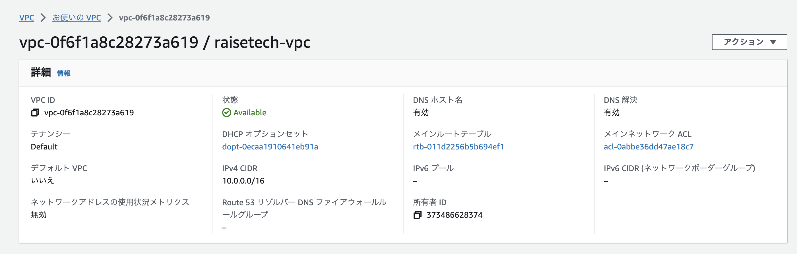
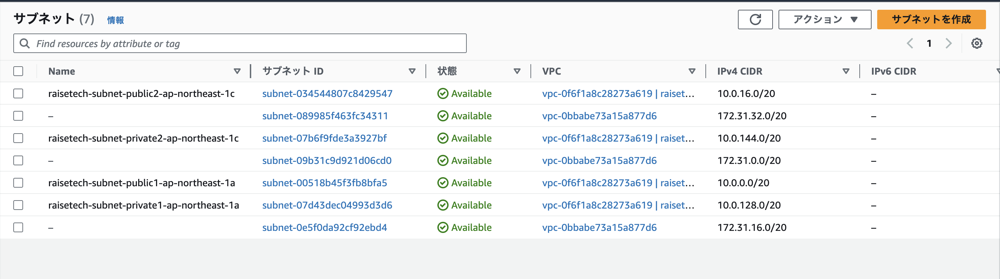
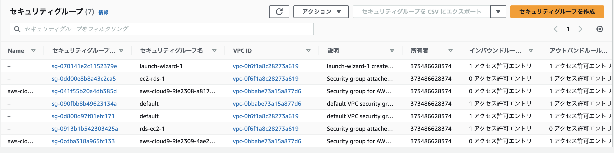
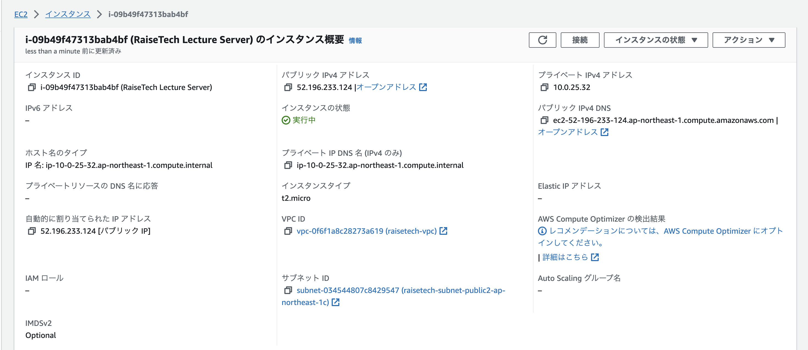
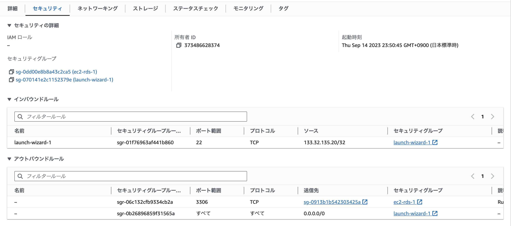
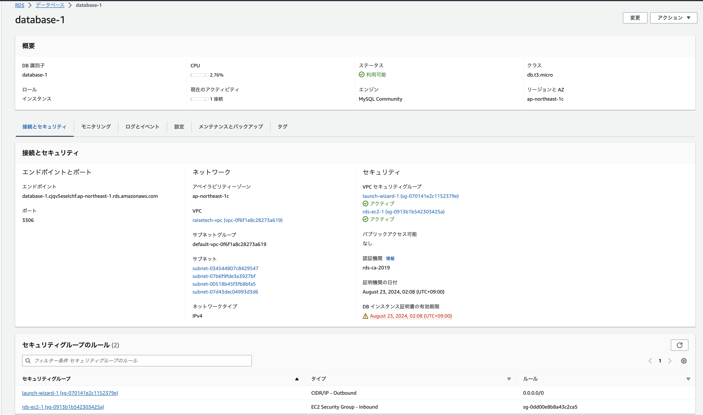
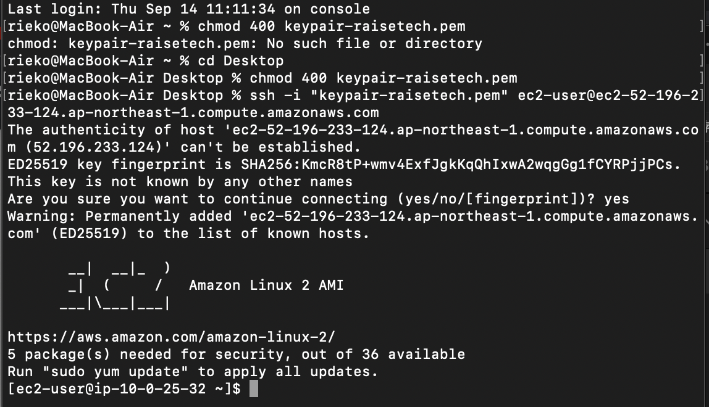
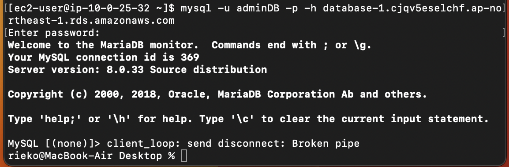

# 第４回講座の課題

## VPCの作成

### サブネット（サブネット名が「raisetech-subnet〜〜」が今回VPC作成時に同時に作成したもの）

### セキュリティグループ（VPC IDが「vpc-0f6f1a8c28273a619」が今回VPC作成時に同時に作成したもの）

## EC2インスタンスの起動

### EC2セキュリティの詳細

## RDSの作成

## EC2の接続

## EC2 から RDS へ接続
