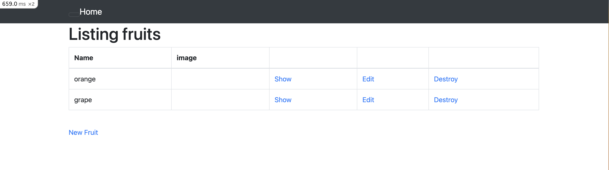

# 第３回講座の課題
## Webアプリケーションの起動

## AP サーバーの名前とバージョン&動作確認
- Puma version 5.6.5
- APサーバーを終了すると青文字でOopsという表示になりアクセスできなくなった。
- bin/setupとbin/cloud9_devの実行で再度サンプルアプリケーションが表示される

## DB サーバーの名前とバージョン&動作確認
- MySQL version8.0.34
- DBサーバーを終了すると赤地白文字の画面が表示されアクセスができなくなった。

## Rails の構成管理ツール
- Bundler

## 今回の課題から学んだこと
Webアプリケーションを扱うにあたり必要な用語を学習した。
- Ruby on Rails：Rubyのフレームワーク
- Gem：外部ライブラリ
- Bundler：Gemを管理するツール（構成管理）
- アプリケーションサーバー：Ruby や Java のようなプログラムで作られたアプリケーションを実行 する為に必要なサーバー。Pumaなど。
- RDBMS：リレーショナルDBを管理するもの。MySQLなど。

 実際のWebアプリケーションの起動は講座動画を繰り返しみながらなんとかできた。失敗して何度も繰り返しているうちに何となく理解してきたという感じなので復習が必要だと感じた。
