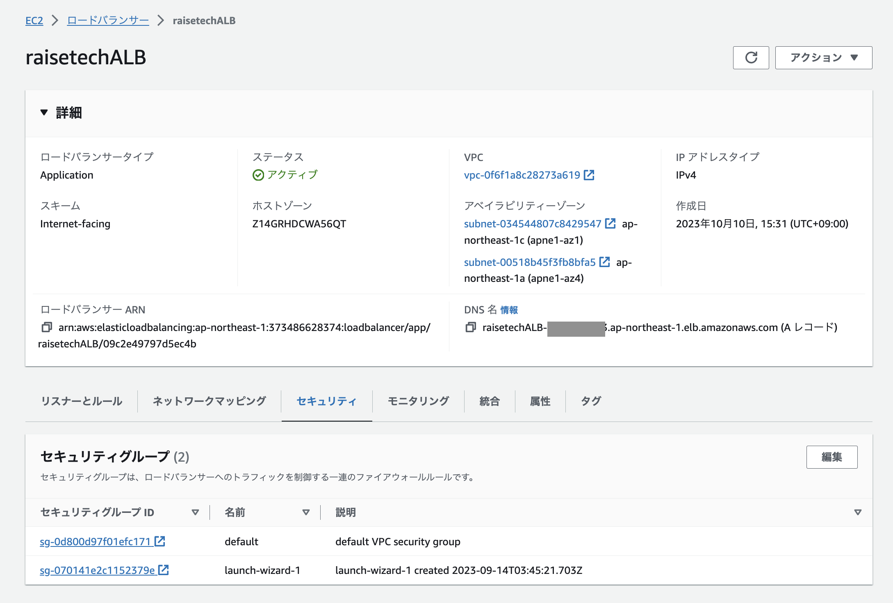

# 第5回課題
第4回で作成したリソースを用いて環境構築・サンプルアプリケーションのデプロイを行う。

## 組み込みサーバー（Puma）でのサンプルアプリケーションの動作確認

```shell
# EC2内のソフトウェアをアップデート
$ sudo yum update -y
# 必要なパッケージをインストール
$ sudo yum install git make gcc-c++ patch openssl-devel libyaml-devel libffi-devel libicu-devel libxml2 libxslt libxml2-devel libxslt-devel zlib-devel readline-devel
```

### Rubyのインストール
```shell
# rbenvをインストール
$ git clone https://github.com/sstephenson/rbenv.git ~/.rbenv
# パスを通す
$ echo 'export PATH="$HOME/.rbenv/bin:$PATH"' >> ~/.bash_profile
# shims と autocompletion の有効化設定を追記
$ echo 'eval "$(rbenv init -)"' >> ~/.bash_profile
# 設定ファイルを反映させる
$ source ~/.bash_profile
```

```shell
# ruby-build のインストール
$ git clone https://github.com/sstephenson/ruby-build.git ~/.rbenv/plugins/ruby-build
$ rbenv rehash
# Rubyをバージョン指定をしてインストール
$ rbenv install -v 3.1.2
# Rubyのバージョン確認
$ ruby -v

# Railsのインストール
$ gem install rails -v7.0.4
# Bundlerのインストール
$ gem install bundler -v 2.3.14
```

### Node.js  のインストール
```shell
# Node.jsのバージョン管理ツールnvmをインストール
$ curl -o- https://raw.githubusercontent.com/nvm-sh/nvm/v0.38.0/install.sh | bash
# プロンプトに「nvm」と表示されることを確認
$ command -v nvm
# nvmが表示されなかった場合はこのコマンドを実行
$ source ~/.bash_profile
# Node.jsをバージョン指定でインストール
$ nvm install v17.9.1
# yarnのインストール
$ npm install --global yarn
```

### サンプルアプリケーションをクローン・ディレクトリに移動
```shell
# サンプルアプリケーションをクローン
$ git clone https://github.com/yuta-ushijima/raisetech-live8-sample-app.git
# サンプルアプリケーションに移動
$ cd raisetech-live8-sample-app
```

### MySQLの設定
```shell
# MySQLをインストール (MariaDBを削除し、MySQLをインストール)
$ curl -fsSL https://raw.githubusercontent.com/MasatoshiMizumoto/raisetech_documents/main/aws/scripts/mysql_amazon_linux_2.sh | sh
# database.ymlを作成
$ cp config/database.yml.sample config/database.yml
```
#### `config/database.yml`を編集
```config/database.yml
default: &default
  adapter: mysql2
  encoding: utf8mb4
  pool: <%= ENV.fetch("RAILS_MAX_THREADS") { 5 } %>
  username: 設定したRDSのユーザーネーム
  password: 設定したパスワード
# hostを追記する
  host: RDSのエンドポイント
```
### 環境構築
```shell
$ bin/setup
```
yarnをインストールするよう指示されれば下記を実行
```shell
$ npm install --global yarn
```

### アプリケーションサーバーの起動
```shell
$ bin/dev
```

### 動作確認
* インバウンドルールを追加：ポート範囲3000を追加
* http://IPアドレス:3000/ でサンプルアプリケーションの動作確認ができた


## NginxとUnicornに分けてのサンプルアプリケーションの動作確認

### Nginx側の設定
* Nginxのインストール
```shell
# amazon-linux-extrasを使ってインストールできるパッケージの確認
$ which amazon-linux-extras/usr/bin/amazon-linux-extras
$ amazon-linux-extras
# Nginxのインストール。y＋エンターキー
$ sudo amazon-linux-extras install nginx1
# Nginxのバージョン確認
$ nginx -v
```

```shell
# 初期設定ファイルのバックアップを取る
$ sudo cp -a /etc/nginx/nginx.conf /etc/nginx/nginx.conf.back
# Nginxの起動
$ sudo systemctl start nginx
# インスタンス起動時にNginxも自動で起動させる
$ sudo systemctl enable nginx
# Nginxの設定確認
$ systemctl status nginx
```


```shell
#ポート確認
$ cat /etc/nginx/nginx.conf
```
→インバウンドルールでポート範囲80を追加する。

* Nginxの接続確認


```shell
# Nginxの停止
$ sudo systemctl stop nginx
```

```shell
# Nginxの設定ファイルの作成＆編集
$ sudo vi /etc/nginx/conf.d/raisetech-live8-sample-app.conf
```
```raisetech-live8-sample-app.conf
upstream unicorn {
  server unix:/home/ec2-user/raisetech-live8-sample-app/unicorn.sock;
}

server {
  listen 80;
  server_name パブリックIPアドレス
  root /home/ec2-user/raisetech-live8-sample-app/public;

  location ^~ /assets/ {
    gzip_static on;
    expires max;
    add_header Cache-Control public;
  }

  location @unicorn {
    proxy_set_header X-Forwarded-For $proxy_add_x_forwarded_for;
    proxy_set_header Host $http_host;
    proxy_redirect off;
    proxy_pass http://unicorn;
  }

  try_files $uri/index.html $uri @unicorn;
  error_page 500 502 503 504 /500.html;
}
```

```shell
# nginxの権限をrootからec2-userに変更
$ cd /etc
$ sudo chown -R ec2-user nginx
```

### Unicornの設定
```shell
# サンプルアプリケーションのディレクトリに移動
cd raisetech-live8-sample-app
```

#### Unicornのインストール（既にインストールされていれば不要）
```shell
# Gemfileにgem 'unicorn'を追記
$ vi Gemfile
$ bundle install
```

#### Unicornの設定ファイルを編集(既に下記のように設定されていれば不要)
```shell
$ vim config/unicorn.rb
```
```ruby:unicorn.rb
listen '/home/ec2-user/raisetech-live8-sample-app/unicorn.sock'
pid    '/home/ec2-user/raisetech-live8-sample-app/unicorn.pid'
```

#### ec2-userディレクトリに他のユーザー(nginx)の権限を付与する（書き込みと実行の権限付与）
```shell
$ chmod 755 /home/ec2-user
```
#### Nginxの再起動
```shell
# Nginxが起動状態であれば停止する
$ sudo systemctl stop nginx
# Nginxの起動
$ sudo systemctl start nginx
```
#### Unicornの起動
```shell
# Unicornの起動
$ bundle exec unicorn_rails -c config/unicorn.rb -E development
# Unicornの起動確認
$ ps -ef | grep unicorn | grep -v grep
```


### CSSの反映
パブリックIPアドレスでアクセス・ブラウザ表示させるもCSSが反映されていない。
*  設定ファイルの編集

`vim config/environments/development.rb`を実行し、
`config.assets.debug = true`を`config.assets.debug = false`に変更

* アセットをプリコンパイル
```shell
bin/rails assets:precompile
```
* Unicornを再起動

### サンプルアプリケーショの動作確認


## ALBの追加
* マネジメントコンソールよりALBを作成（EC2＞ロードバランサー）




DNS名でブラウザ表示させるとエラーが表示される。
* `config/environments/development.rb`の最終行に`config.hosts<<DNS名`を追加
* Unicornを再起動

### サンプルアプリケーションの動作確認


## S3の追加
* マネジメントコンソールよりバケットを作成する
* IAMロールを作成し、EC2に割り当てる

* `config/storage.yml`のバケット名を作成したバケット名に変更
* `config/environments/development.rb`の`active storage service`を`amazon`に変更

### 動作確認
* サンプルアプリケーションの動作確認

* S3に保存されていることも確認


## 構成図の作成

