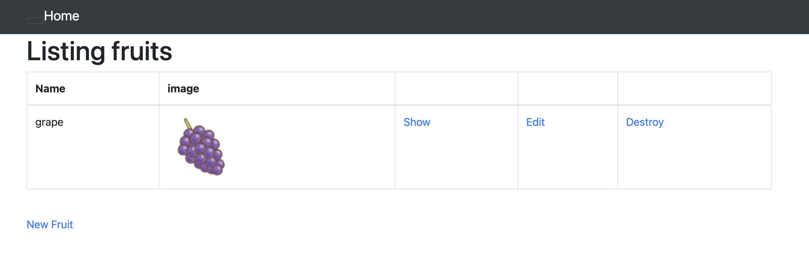

# 第5回課題

## 組み込みサーバー（Puma）でのサンプルアプリケーションの動作確認
* $ sudo yum update -y：EC2内のソフトウェアをアップデート
* $ sudo yum install git make gcc-c++ patch openssl-devel libyaml-devel libffi-devel libicu-devel libxml2 libxslt libxml2-devel libxslt-devel zlib-devel readline-devel：必要なパッケージをインストール

* rbenv（Rubyのバージョン管理ツール）をインストール
    * $ git clone https://github.com/sstephenson/rbenv.git ~/.rbenv：rbenvをインストール
    * $ echo 'export PATH="$HOME/.rbenv/bin:$PATH"' >> ~/.bash_profile：パスを通す
	* $ echo 'eval "$(rbenv init -)"' >> ~/.bash_profile：shims と autocompletion の有効化設定を追記
	* $ source ~/.bash_profile：設定ファイルを反映させる

* ruby-build のインストール
    * $ git clone https://github.com/sstephenson/ruby-build.git ~/.rbenv/plugins/ruby-build
	* $ rbenv rehash
	* $ rbenv install -v 3.1.2：Rubyをバージョン指定をしてインストール
* $ ruby -v：Rubyのバージョン確認

* $ gem install rails -v7.0.4：Railsのインストール

* $ gem install bundler -v 2.3.14：Bundlerのインストール

* Node.js  のインストール
    * $ curl -o- https://raw.githubusercontent.com/nvm-sh/nvm/v0.38.0/install.sh | bash：Node.jsのバージョン管理ツールnvmをインストール
    * $ command -v nvm：プロンプトに「nvm」と表示されることを確認
    * $ source ~/.bash_profile：nvm」が表示されなかった場合はこのコマンドを実行
    * $ nvm install v17.9.1：Node.jsをバージョン指定でインストール

* $ npm install --globalyarn：yarnのインストール

* $ git clone https://github.com/yuta-ushijima/raisetech-live8-sample-app.git　：：サンプルアプリケーションをクローン

* $ cd raisetech-live8-sample-app：サンプルアプリケーションに移動

* $ curl -fsSL https://raw.githubusercontent.com/MasatoshiMizumoto/raisetech_documents/main/aws/scripts/mysql_amazon_linux_2.sh | sh：MySQLをインストール

* $ cp config/database.yml.sample config/database.yml ：database.ymlを作成
* $ vim config/database.yml：database.ymlを編集（defaultの欄に以前設定したRDSのusername,PWを記入＆hostの項目を追加しエンドポイントを追記）

* $ bin/setupを実行するとyarnをインストールするよう指示。
* $ npm install --global yarn
* 再度$ bin/setup
* $ bin/dev

* インバウンドルールを追加：ポート範囲3000を追加
* http://IPアドレス:3000/ でサンプルアプリケーションの動作確認ができた

## NginxとUnicornに分けてのサンプルアプリケーションの動作確認

### Nginx側の設定
* Nginxのインストール
    * amazon-linux-extrasを使ってインストールできるパッケージの確認
        * $ which amazon-linux-extras/usr/bin/amazon-linux-extras
        * $ amazon-linux-extras
	* $ sudo amazon-linux-extras install nginx1：Nginxのインストール。y＋エンターキー
	* $ nginx -v：Nginxのバージョン確認
* $ sudo cp -a /etc/nginx/nginx.conf /etc/nginx/nginx.conf.back：初期設定ファイルのバックアップを取る
* ＄sudo systemctl start nginx：Nginxの起動
* $ sudo systemctl enable nginx：インスタンス起動時にNginxも自動で起動させる
* $ systemctl status nginx：Nginxの設定確認

* $ cat /etc/nginx/nginx.confでポート確認→インバウンドルールでポート範囲80を追加する。
* Nginxの接続確認

* $ sudo systemctl stop nginx：Nginxの停止

* $ sudo vi /etc/nginx/conf.d/raisetech-live8-sample-app.conf：Nginxの設定ファイルの作成＆編集

* $ sudo chown -R nginx nginx：nginxの権限をrootからec2-userに変更

### Unicornの設定
* cd raisetech-live8-sample-app：サンプルアプリケーションのディレクトリに移動
* $ vi Gemfile：Gemfileの編集。group :production, :staging doの項目に gem 'unicorn'を追記
* $ bundle install
* $ vim config/unicorn.rb；Unicornの設定ファイルを編集
		listen '/home/ec2-user/raisetech-live8-sample-app/unicorn.sock'
		pid    '/home/ec2-user/raisetech-live8-sample-app/unicorn.pid'
		
* $ chmod 755 /home/ec2-user：ec2-userディレクトリに他のユーザー(nginx)の権限を付与する（書き込みと実行の権限付与）
* Nginxの再起動
* $ bundle exec unicorn_rails -c config/unicorn.rb -E development：Unicornの起動
* $ ps -ef | grep unicorn | grep -v grep：Unicornの起動確認

* ブラウザ表示させるもCSSが反映されていない。→config/environments/development.rbのconfig.assets.debug = trueをconfig.assets.debug = falseに変更
* サンプルアプリケーショの動作確認

## ALBの追加
* マネジメントコンソールよりALBを作成（EC2＞ロードバランサー）

DNS名でブラウザ表示させるとエラーが表示される。
* config/environments/development.rbの最終行にconfig.hosts<<DNS名を追加
* サンプルアプリケーションの動作確認

## S3の追加
* マネジメントコンソールよりバケットを作成する
* IAMロールを作成し、EC2に割り当てる

* config/storage.ymlのバケット名を作成したバケット名に変更
* config/environments/development.rbのactive storage serviceをamazonに変更
* サンプルアプリケーションの動作確認

* S３に保存されていることも確認

## 構成図の作成

