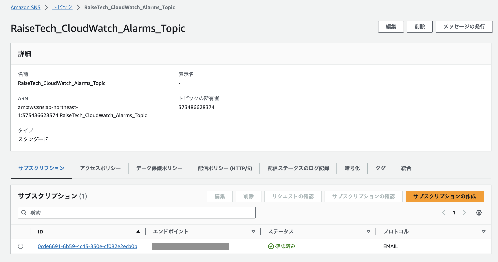
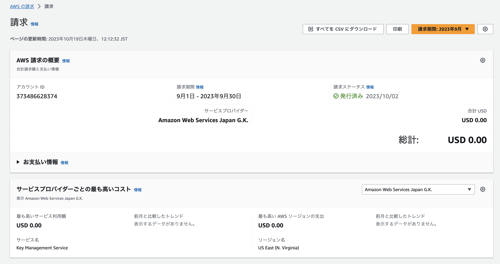

# 第６回課題

## 最後にAWSを利用した日の記録をCloudTrailのイベントから探し出す
CloudTrail>イベント履歴で確認

上記よりIAMユーザー名のイベントを抜粋

1. ConsoleLogin ：AWS Management Consoleにブラウザ経由でログインした場合に記録

2. CheckMfa：MFAを確認またはチェックした場合に記録（今回はAWSリソースにアクセスしようとするユーザーがMFAを使用して認証した。）

3. ActivateEC2Remote：AWS Cloud9 IDEが接続するAmazon EC2インスタンスをスタートする許可を付与

## CloudWatchでALBのアラームとアクションを設定
メトリクスアラームのUnHealthyHostCountを作成した。
アラーム状態の時とOK状態の時、トピック「RaiseTech_CloudWatch_Alarms_Topic」にメッセージを送信するよう設定した。

* アプリケーション起動時：OKメールが送信される

* アプリケーション停止時：ALARMメールが送信される

## コスト管理
### AWS利用料の見積もりの作成
AWS Pricing Calculatorより作成

[見積もり](https://calculator.aws/#/estimate?id=f3a89c939e52637fec8d4fdaf58a90e50a2e7a80)

### 現在の利用料
* 10月の利用料

* 9月の利用料：請求期間を9月に変更

* EC2の料金

EC2は本課題作成時（10月）は無料枠内だが、今月Data Transferで0.01$の請求予定がある。

