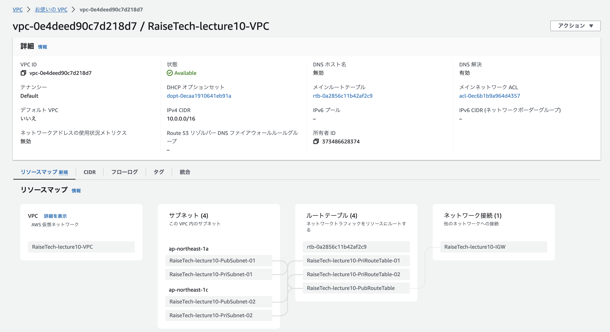
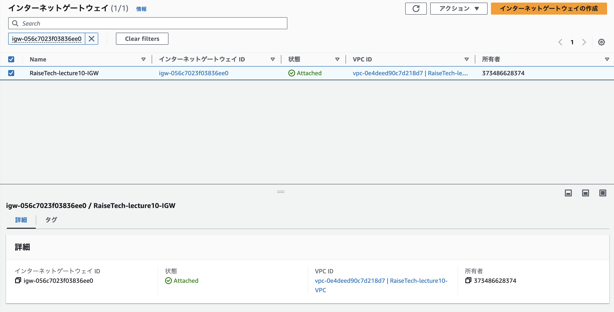
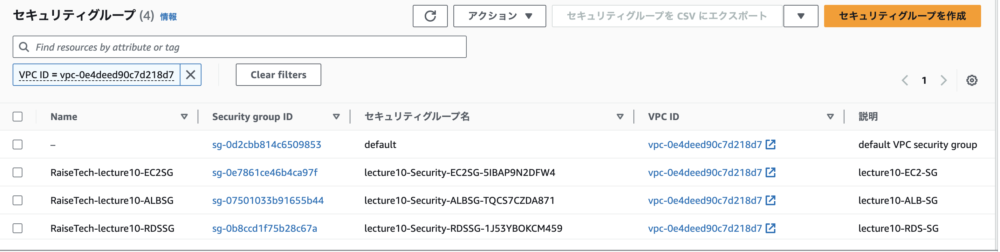
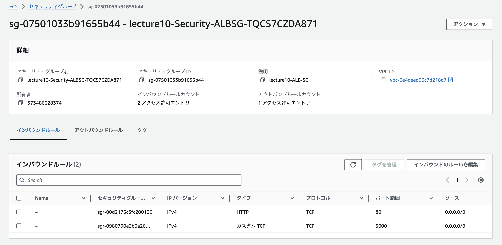
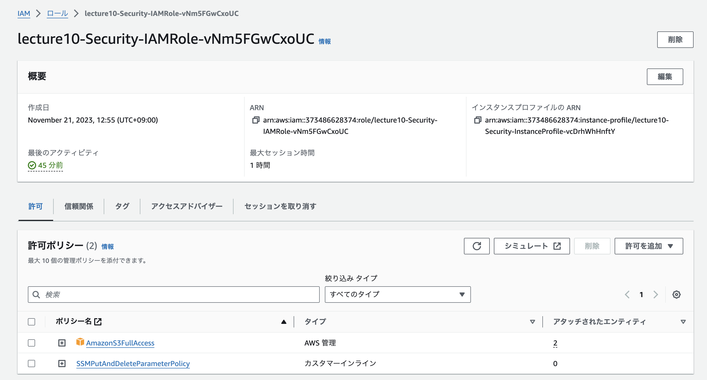
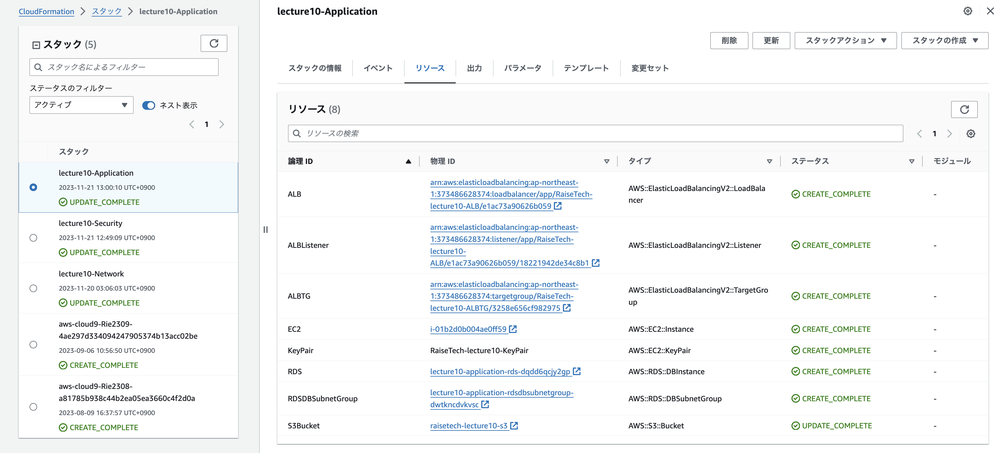
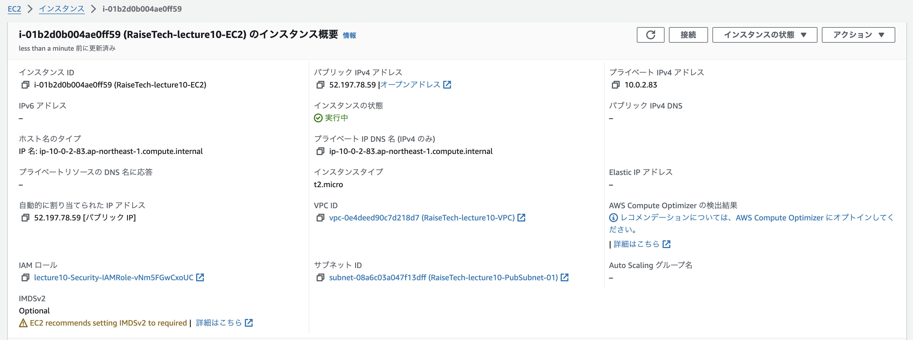
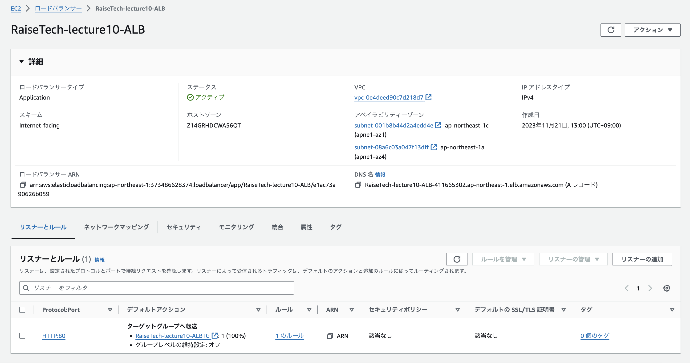
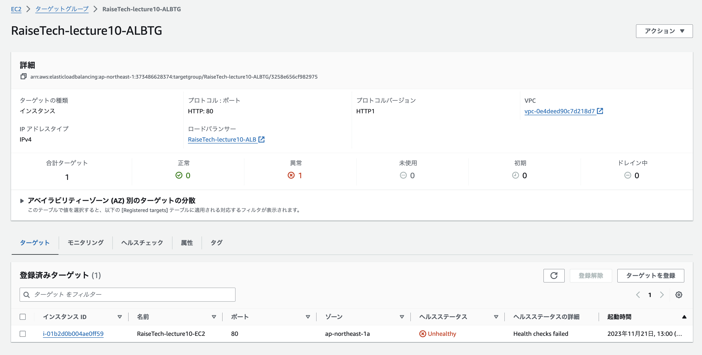
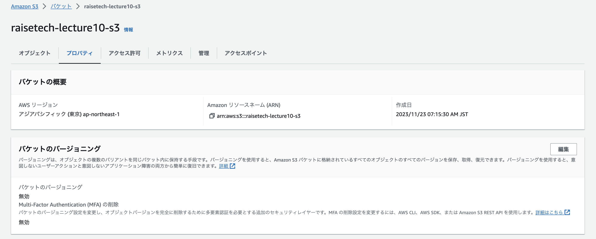

# 第10回課題
以下の３つ（ネットワーク層・セキュリティ層・アプリケーション層）にテンプレートを分割して.ymlファイルを作成し、CloudFormationにて環境構築を行った。

* [lecture10_Network.yml](./lecture10-templates/lecture10_Network.yml)
* [lecture10_Security.yml](./lecture10-templates/lecture10_Security.yml)
* [lecture10_Application.yml](./lecture10-templates/lecture10_Application.yml)

## コンソール画面にて構築した環境を確認
### ネットワーク関連

リソース

* VPC

* インターネットゲートウェイ

* サブネット

### セキュリティ関連

リソース

* セキュリティグループ全般

* EC2セキュリティグループ

* RDSセキュリティグループ

* ALBセキュリティグループ

* IAMロール：AmazonS3FullAccessを許可

### アプリケーション関連

リソース

* EC2

* RDS

* ALB

* ALBターゲットグループ

* S3バケット

## 第１０回講座・課題作成で学んだこと
### 講座での学び
* Infrastructure as Code (IaC)：インフラ自動化の前提であり、インフラ環境を全てコードで表現するという考え方
* クラウドサービスはAWSの他にAzure（Microsoft社）、Google Cloudがある。
* 自動化のメリットとして「再現性」が挙げられ、問題解決の利点、再現の速さ、環境が仮想化されていることによるサーバー管理が不要といったことによるコスト削減が可能。また、コードで管理されていることによってバージョン管理も可能。しかしデメリットとして自動化のための人員確保が必要である。

### 課題作成時における学び
実際にCloudFormationのテンプレートファイルやスタックを作成することによって各々のリソースの役割やつながりを理解することができた。
* CloudFormationで用いる組み込み関数は下記を活用した。
    * `!Sub`：入力文字列の変数を、指定した値に置き換える。変数は`${MyVarName}`として書き込む。
    * `!Ref`：指定したパラメータまたはリソースの値を返す。
    * `!ImportValue`：別のスタックによってエクスポートされた出力の値を返す。（クロススタック参照）
    * `Base64`：`UserData`プロパティを介して AmazonEC2インスタンスにエンコードされたデータを渡す。

* .ymlファイルを作成する際にインデントの誤りで多数エラーを経験した。参照元をコピー＆ペーストをするとインデントがずれることもあったため、テンプレート作成時には気をつけたい。
