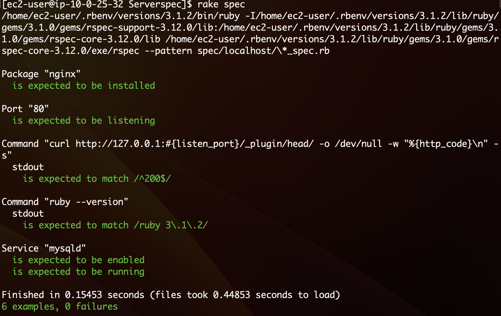
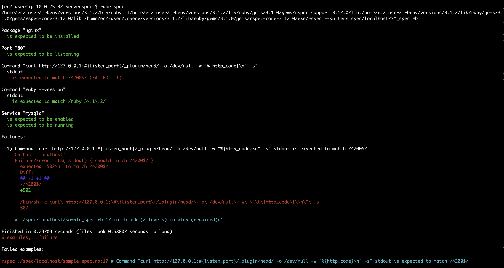

# 第11回課題
[サンプル](https://github.com/MasatoshiMizumoto/raisetech_documents/tree/main/aws/samples/serverspec)を用いてServerSpecのテストが成功することを確認する。

## ServerSpecのインストール・設定
今回課題は第5回で作成したEC2を活用した。

### ServerSpecのインストール
```
# ServerSpec用のディレクトリを作成・移動
$ mkdir Serverspec
$ cd Serverspec
```
```
# ServerSpecのインストール
$ gem install serverspec
```

### ServerSpecの初期設定
```
$ serverspec-init
Select OS type:

  1) UN*X
  2) Windows

Select number: 1

Select a backend type:

  1) SSH
  2) Exec (local)

Select number: 2

 + spec/
 + spec/localhost/
 + spec/localhost/sample_spec.rb  # 実際にテストする内容を記載するファイル
 + spec/spec_helper.rb  # テストに関する全般的な設定ファイル
 + Rakefile  # rakeコマンドを使ってテスト実行のためのタスク定義ファイル
 + .rspec  # RSpecの挙動を設定するファイル
```

## テストコードの編集
`spec/localhost/sample_spec.rb`を下記の内容に変更する（サンプルのテストコード置換と2つのテストコードを追加）
```ruby:sample_spec.rb
require 'spec_helper'

listen_port = 80 # 80に変更

# nginxがインストールされているか確認
describe package('nginx') do
  it { should be_installed }
end

# 指定したポートがリッスンされているかどうかを確認
describe port(listen_port) do
  it { should be_listening }
end

# HTTPリクエストを送った際に正常な応答が得られるかを確認。ステータスコード200はHTTPリクエストが成功したことを示す。
describe command('curl http://127.0.0.1:#{listen_port}/_plugin/head/ -o /dev/null -w "%{http_code}\n" -s') do
  its(:stdout) { should match /^200$/ }
end

# rubyが指定したバージョンでインストールされているか確認 
describe command('ruby --version') do
  its(:stdout) { should match /ruby 3\.1\.2/ }
end

# MySQLのサービスが正常に稼働している
describe service('mysqld') do
  it { should be_enabled   }
  it { should be_running   }
end
```

## テストの実行
```
$ rake spec
```
### テスト結果
* テスト成功：サンプルアプリケーションを起動した状態で実施



* テスト失敗：Unicornを停止しサンプルアプリケーションが起動されていない状態



## テストコードの記述について
Serverspecのテストコードは、リソースタイプとマッチャーの組み合わせで記述する。
```
describe リソースタイプ(**) do
  it { マッチャー }
end
```
* リソースタイプ：テスト対象のリソースの種類（例：command,host,package等）
[リソースタイプ](https://serverspec.org/resource_types.html)

* マッチャー：リソースのあるべき状態（例：should exist,should match等）
