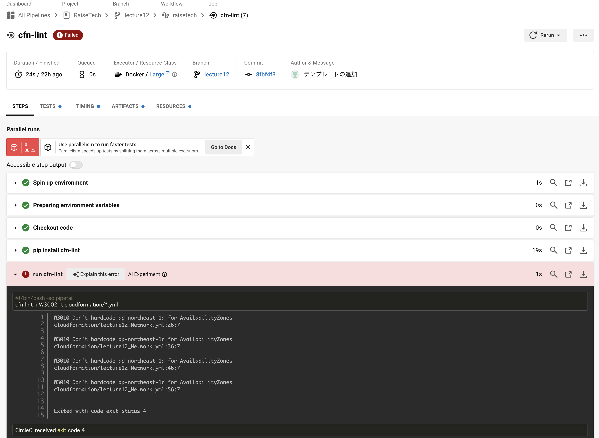
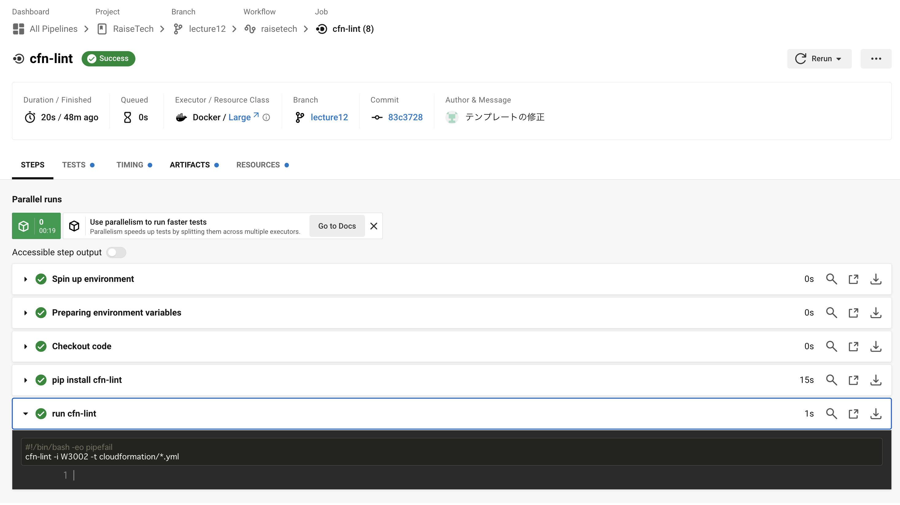

# 第１２回講座課題

[CircleCI のサンプルコンフィグ](https://github.com/MasatoshiMizumoto/raisetech_documents/tree/main/aws/samples/circleci)を用いて、これが正しく動作するかを確認する。


## 課題を作成するにあたっての事前準備
* CircleCI のローカル CLI のインストール
    ```
    $ brew install circleci
    ```
* [公式ドキュメントのスタートガイド](https://circleci.com/docs/ja/getting-started/)を参考にし、動作を理解する。

    1. ユーザー登録：GitHubアカウントと連携
    2. Projectsを選択する。課題用リポジトリをset upする。
    3. `Select a config.yml`で`Fast`を選択し、サンプル設定ファイルの`Hello World`を選択する。
    4. CircleCIコンフィグエディタに、サンプルの`config.yml`があらかじめ入力されている。`Commit and Run`をクリックする。
    5. Successと書かれたパイプラインが表示される。

* 上記の方法を行うと課題用リポジトリに`circleci-project-setup`というブランチが新規作成される。課題のブランチ名を統一させたかったため本課題に入る前にブランチを削除した。


## 課題用レポジトリでの動作確認
課題で与えられたCircleCIのサンプルコンフィグは、cfn-lintが`cloudformation`ディレクトリ内の`yml`ファイルをチェックするものとなっている。

1. `lecture12`ブランチを作成し、[.circleci/config.yml](../.circleci/config.yml)をプッシュする。
2. CircleCIのアプリ画面で再度プロジェクトを選択し、`Select a config.yml`で`Fastest`を選択。ブランチは`lecture12`。
3. `cloudformation/lecture12_Network.yml`（第10回で作成したテンプレートを一部変更したもの）をプッシュする。

    `AvailabilityZone`をハードコーディングしていることについてのエラーが出る。
    

4. 修正した[cloudformation/lecture12_Network.yml](../cloudformation/lecture12_Network.yml)をプッシュする。



## 第１２回講座・課題に関する用語の確認
* **DevOps**：「開発(Dev)」と「運用(Ops)」を組み合わせた言葉。開発チームと運用チームのライフサイクルを一緒にして協力関係化する事により、ビジネス価値を高めやすい開発と運用を行う為の技術や行動の総称。

* **CI/CDツール**：「Continuous Integration（「継続的インテグレーション）/Continuous Delivery（継続的デリバリー）」の略称。
アプリケーションやインフラ環境のコードに関わる部分のテストを自動化し、常にリリース可能な状態にする事をCI(継続的インテグレーション)という。リリース可能にするだけではなく、リリースまで行うケースを CD(継続的デリバリー)という。
    * ジョブ：定形作業を自動化した小さな単位
    * トリガー：「前のジョブが完了したら実行する」「指定の時間が来たら定期的に実行する」など、詳細に指定できる起動条件
    * パイプライン：上記の機能を一連の流れ。呼び出すときの記述が容易にな
る、全体の可視化がしやすいなどのメリットがある。

* **Jenkins**：CI/CDツールの一種。カスタマイズ性が高いというメリットはあるが、サーバーの管理が必要といったデメリットがある。

* **CircelCI**：SaaS型のCI/CDツール。環境構築のコストも低く、手軽に導入が可能。

* **GitHub Actions**：GitHubで提供しているCIツール。ワークフローの実行回数が多いとランナー利用料が発生するため、実行数の多いプロジェクトの場合は高コストになる可能性がある。

* **AWS CodeBuild**：AWSが提供するCI/CDツールの一つでビルド処理を行うサービス。
