# 第13回課題
CircleCIのサンプルにServerSpecやAnsibleの処理を追加する。
## 全体の構成図
本課題の手順を下の図のように考えて課題を進めた。
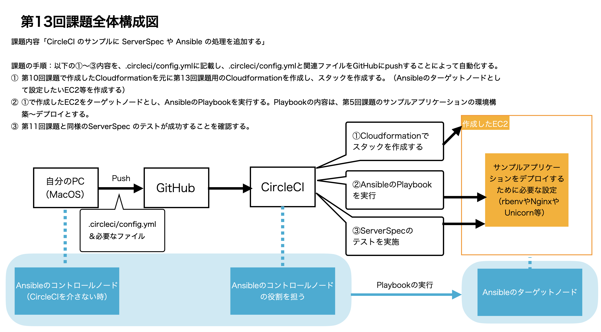


CircleCIのWorkflow全体の結果
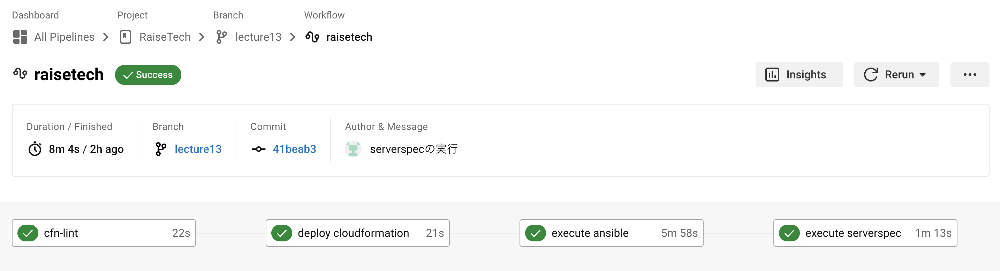

## ① CloudFormationのテンプレートを用いてスタックの作成
### Ansibleのターゲットノードとして設定したいEC2等作成する
* AWSのコンソール画面よりアクセスキーを作成し、CircleCIに追加する。

#### 使用したテンプレート
* [lecture13_Network.yml](../cloudformation/lecture13_Network.yml)
* [lecture13_Security.yml](../cloudformation/lecture13_Security.yml)
* [lecture13_Application.yml](../cloudformation/lecture13_Application.yml)


#### Cloudformationをデプロイするジョブ
```
  deploy cloudformation:
    executor: aws-cli/default
    steps:
      - checkout
      - aws-cli/setup:
          aws_access_key_id: AWS_ACCESS_KEY_ID
          aws_secret_access_key: AWS_SECRET_ACCESS_KEY
          region: AWS_DEFAULT_REGION
      - run:
          name: Deploy cloudformation
          command: |
            aws cloudformation deploy --template-file cloudformation/lecture13_Network.yml --stack-name lecture13-Network
            aws cloudformation deploy --template-file cloudformation/lecture13_Security.yml --stack-name lecture13-Security --parameter-overrides MyIP=$MY_IP --capabilities CAPABILITY_IAM
            aws cloudformation deploy --template-file cloudformation/lecture13_Application.yml --stack-name lecture13-Application
```
#### 結果
* CircleCIの`deploy cloudformation`の結果
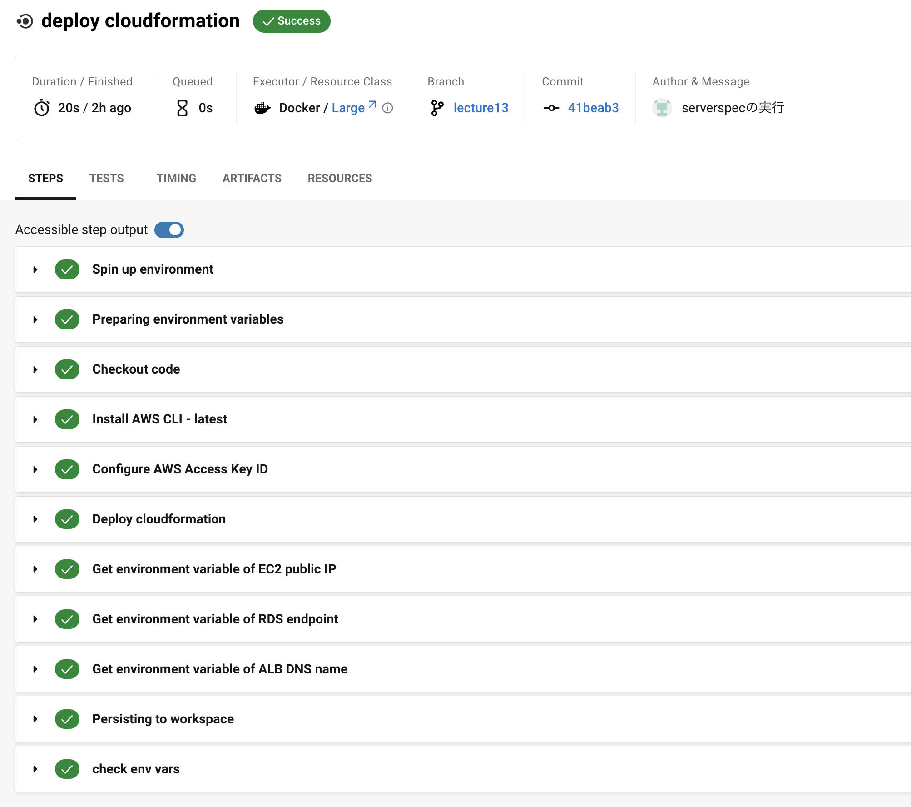

* スタック作成
   * ネットワーク関連
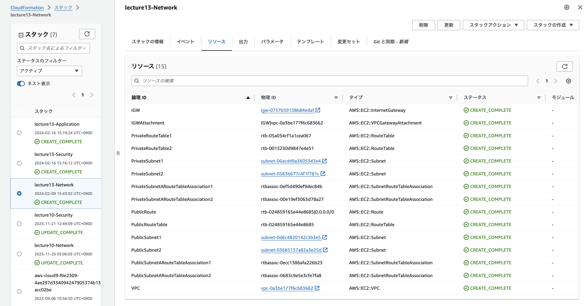
   * セキュリティ関連
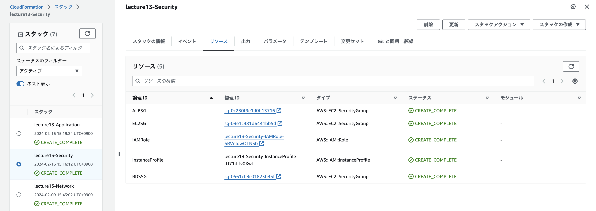
   * アプリケーション関連
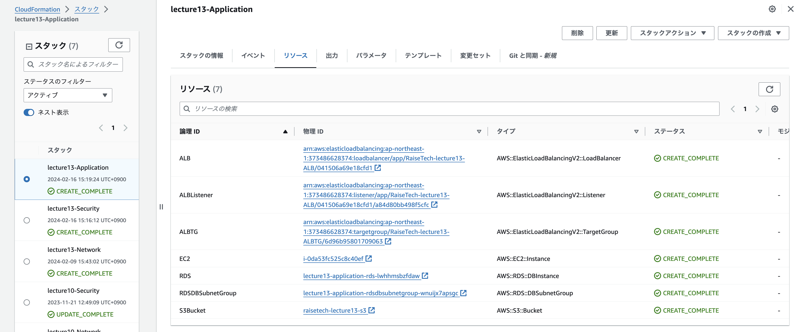

## ② Ansible Playbookの実行
①で作成したEC2をターゲットノードとし、AnsibleのPlaybookを実行する。
Playbookの内容は、第5回課題[第5回課題](../lecture05.md)のサンプルアプリケーションの環境構築〜デプロイとする。

### 1. CircleCIを介さない方法でAnsible Playbookの実行
#### Ansibleのインストールとplaybookの実行
```
# Ansibleのインストール
$ brew install ansible
```

Ansibleのバージョンを確認した際に`config file = None`と表示されたため、`ansible.cfg`を作成する
```
# configファイルの設定
$ ansible-config init --disabled > ansible.cfgのパス
```

Ansible用のディレクトリを作成と必要なファイルの作成
```
$ mkdir ansible
$ cd ansible
$ touch inventory
$ touch playbook.yml

# 他rolesディレクトリ下のファイルを作成
```

#### 参考
playbookのモジュールの記載方法
* [ansible.builtin.git module](https://docs.ansible.com/ansible/latest/collections/ansible/builtin/git_module.html)
* [ansible.builtin.yum module](https://docs.ansible.com/ansible/latest/collections/ansible/builtin/yum_module.html)
* [ansible.builtin.lineinfile module](https://docs.ansible.com/ansible/latest/collections/ansible/builtin/lineinfile_module.html)
* [ansible.builtin.rpm_key module](https://docs.ansible.com/ansible/latest/collections/ansible/builtin/rpm_key_module.html)
* [ansible.builtin.template module](https://docs.ansible.com/ansible/latest/collections/ansible/builtin/template_module.html)
* [ansible.builtin.service module](https://docs.ansible.com/ansible/latest/collections/ansible/builtin/service_module.html)

#### ansible-playbookのコマンドとオプション
```
# 通常実行
$ ansible-playbook -i inventory playbook.yml

# playbookの構文チェックのみ実行
$ ansible-playbook -i inventory playbook.yml -—syntax-check

# playbookのドライラン
$ ansible-playbook -i inventory playbook.yml -—syntax-check

# 実行内容詳細を表示(-v、-vv、-vvv)
$ ansible-playbook -i inventory playbook.yml -v
```


### 2. CircleCIでAnsible Playbookの実行
#### 環境変数の設定
* あらかじめ値が分かるものはCircleCIのコンソールで設定。
   * `KEY_FINGERPRINT`・`PRIVATE_KEY_FILE`・`AWS_DB_USERNAME`・`AWS_DB_PASSWORD`

* スタックを作成するまで値がわからないものは`.circleci/config.yml`で環境変数を設定するステップを記載をした。
   * `AWS_EC2_PUBLIC_IP`・`AWS_RDS_ENDPOINT`・`AWS_ALB_DNS_NAME`

#### ジョブの記載
ジョブの記載内容：[.circleci/config.yml](../.circleci/config.yml)の`execute ansible`

#### 結果
* CircleCIの`execute ansible`の結果
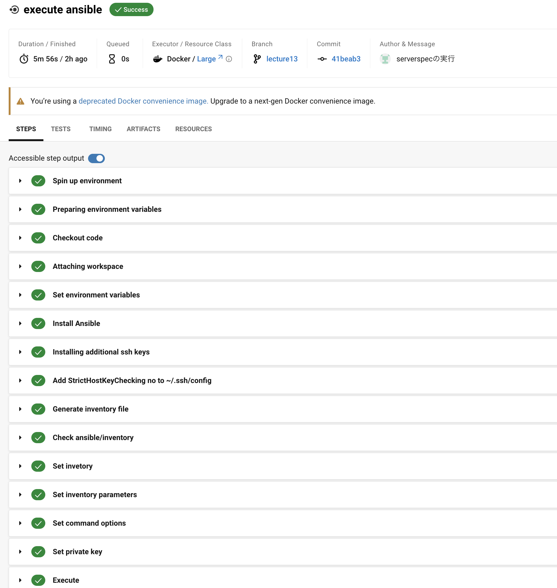
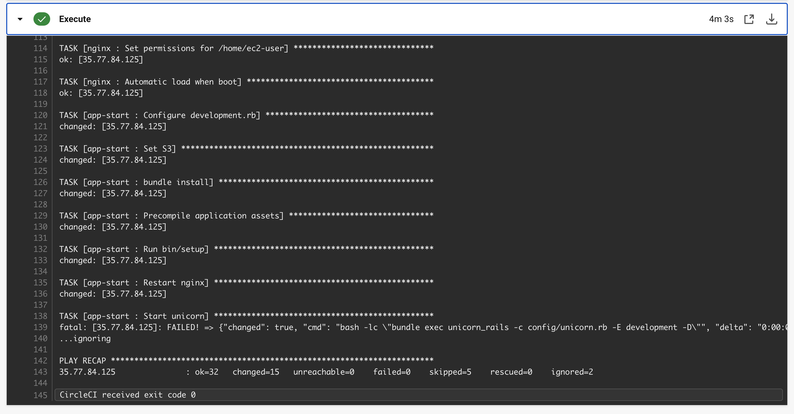

* サンプルアプリケーションのデプロイ結果（ALBのDNSでブラウザ表示）
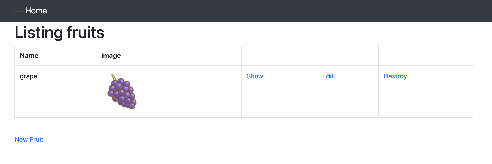

* S3へのアクセス確認（オブジェクトが保存されていることを確認）
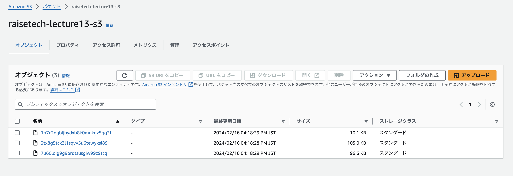

## ③ CircleCIにServerSpecを追加し自動テストを実施
### ServerSpecの設定
ServerSpec用のディレクトリを作成し、gemのインストール
```
$ touch serverspec
$ cd serverspec
$ bundle init
```
[Gemfile](../serverspec/Gemfile)に必要なGemを記載し、`bundle install`を実行
```
$ bundle install --path vendor/bundle
```

 ServerSpecの設定
 ```
 $ bundle exec serverspec-init
 Select OS type:

  1) UN*X
  2) Windows

Select number: 1

Select a backend type:

  1) SSH
  2) Exec (local)

Select number: 1

Vagrant instance y/n: n
Input target host name: ホスト名
 + spec/
 + spec/ホスト名/
 + spec/ホスト名/sample_spec.rb
 + spec/spec_helper.rb
 + Rakefile
 + .rspec
 ```

### CircleCI側で行うこと
* テスト対象サーバーに接続できるように`~/.ssh/config`を設定
 ```~/.ssh/config
 Host ホスト名
  HostName 対象サーバーのパブリックIPアドレス
  User ec2-user
  StrictHostKeyChecking no
 ```
* [spec_helper.rb](../serverspec/spec/spec_helper.rb)のuserを変更
* テスト内容を[sample_spec.rb](../serverspec/spec/ansible_client/sample_spec.rb)に記載

### 結果
 CircleCIの`execute serverspec`の結果
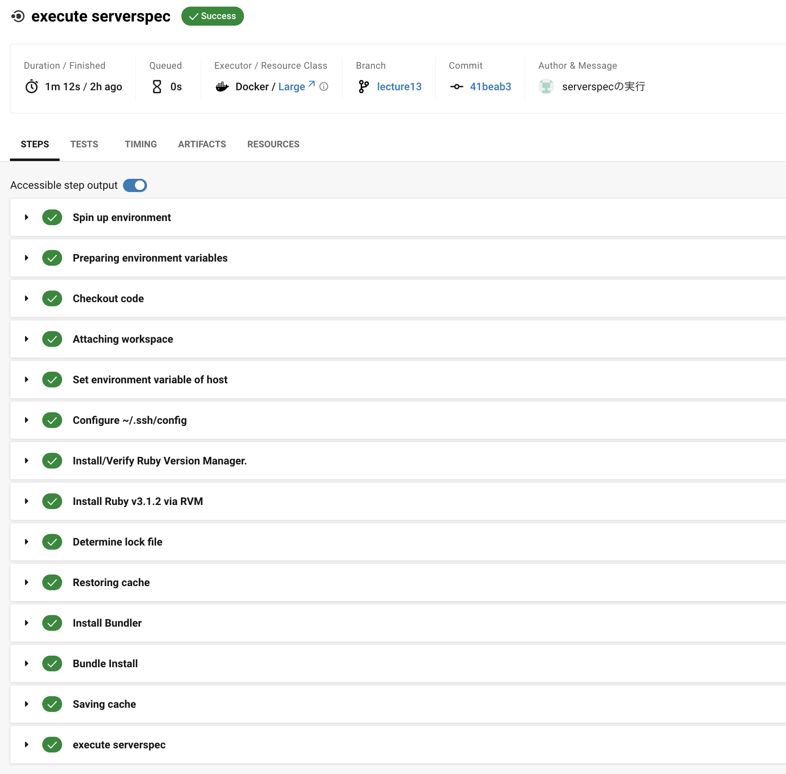
テストが成功していることを確認
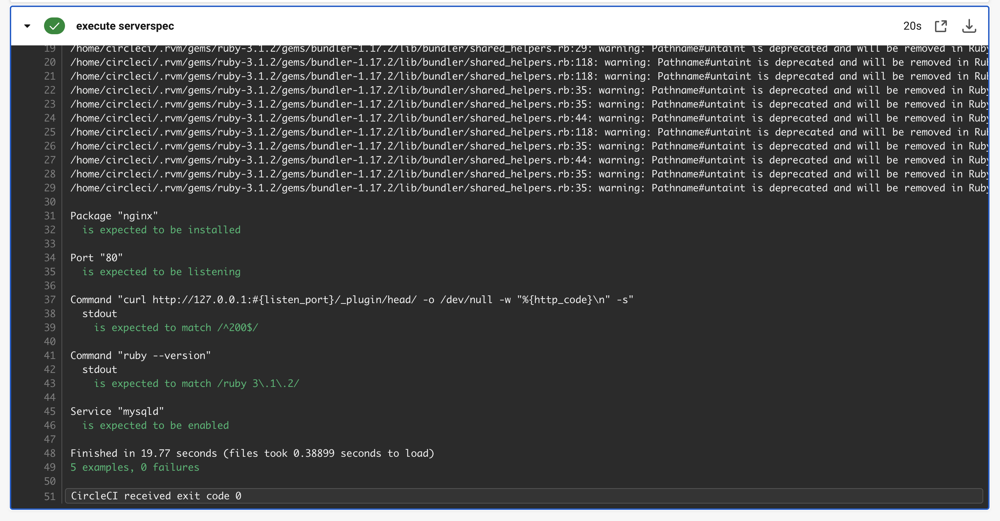
